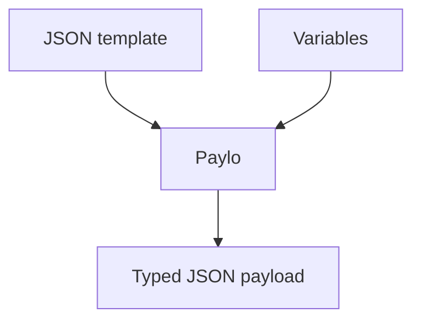

## From a template to a payload

- **01 · Template**

    Define placeholders in valid JSON.

- **02 · Variables**

    Supply explicit dictionaries from your test data.

- **03 · Payload**

    Receive JSON values with their original types.

Use it from Python or Robot Framework with the same behavior. MIT licensed, with source and executable examples on GitHub.

## What it does

- Fill nested JSON values with `{{name}}` placeholders.
- Keep numbers, booleans, nulls, arrays and objects as their real types.
- Reuse dictionaries from pytest, Robot or Pytabify; no network requests are sent.

## Try it with your data

[Open the interactive example](assets/demo/index.html) and edit the template and variables.

