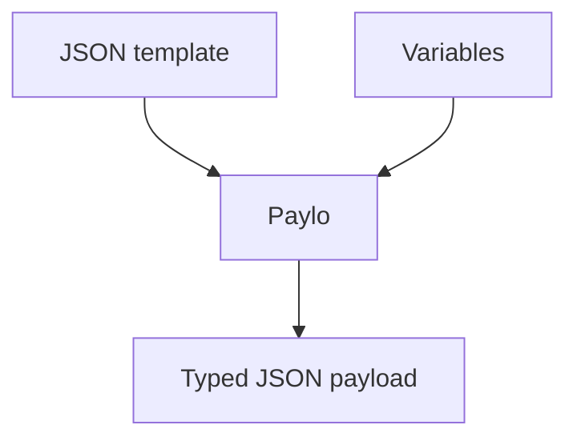

## De una plantilla a un payload

- **01 · Plantilla**

    Define placeholders dentro de un JSON válido.

- **02 · Variables**

    Proporciona diccionarios explícitos con tus datos de prueba.

- **03 · Payload**

    Recibe valores JSON con sus tipos originales.

Úsala desde Python o Robot Framework con el mismo comportamiento. Licencia MIT, código y ejemplos ejecutables en GitHub.

## Qué hace

- Completa valores JSON anidados con variables `{{name}}`.
- Conserva números, booleanos, nulos, listas y objetos.
- Reutiliza diccionarios de pytest, Robot o Pytabify; no envía peticiones HTTP.

## Pruébalo con tus datos

[Abre el ejemplo interactivo](assets/demo/index.html) y edita la plantilla y las variables.

